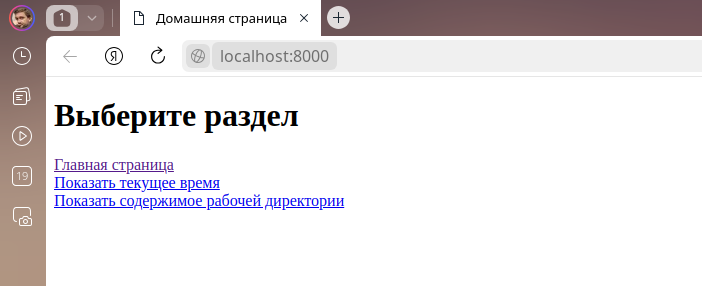
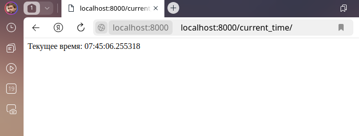
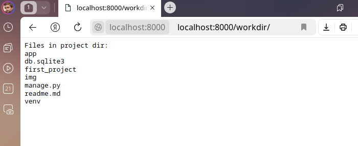

# Домашнее задание по теме "01. Работа с проектом и приложением"

## Выполнил Шаповалов Кирилл, студент группы DJ-90

Доработал `views.py` следующим образом:

```py
from django.http import HttpResponse
from django.shortcuts import render, reverse

import os, datetime


def home_view(request):
    template_name = 'app/home.html'
    pages = {
        'Главная страница': reverse('home'),
        'Показать текущее время': reverse('time'),
        'Показать содержимое рабочей директории': reverse('workdir')
    }
    
    context = {
        'pages': pages
    }
    return render(request, template_name, context)


def time_view(request):
    current_time = datetime.datetime.now().time()
    msg = f'Текущее время: {current_time}'
    return HttpResponse(msg)


def workdir_view(request):
    path = '.'
    list_of_files = f'Files in project dir:\n{chr(10).join(map(str, sorted(os.listdir(path))))}'
    return HttpResponse(list_of_files, content_type="text/plain")
```

Так же изменил `urls.py`:

```py
from django.contrib import admin
from django.urls import path, include

from app.views import home_view, time_view, workdir_view


urlpatterns = [
    path('', home_view, name='home'),
    path('current_time/', time_view, name='time'),
    path('workdir/', workdir_view, name='workdir'),
    path('admin/', admin.site.urls),
]
```

Итог - проверяю, что все страницы доступны и выводят необходимое содержимое. Запустил сервер командой `python manage.py runserver`.

По адресу http://127.0.0.1:8000 открывается `home_view`:



<br />

По адресу http://127.0.0.1:8000/current_time/ открывается `time_view`:



<br />

По адресу http://127.0.0.1:8000/workdir/ открывается `workdir_view`:

