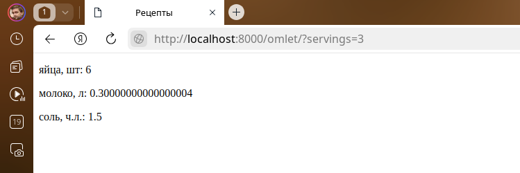

# Домашнее задание по теме "02. Обработка запросов и шаблоны"

## Выполнил Шаповалов Кирилл, студент группы DJ-90

В `app - calculator` написал следующую view-функцию:

```py
def recipe_view(requests, get_recipe):
    template_name = "calculator/index.html"
    servings = int(requests.GET.get('servings', 1))
    dishes = {}
    for dish, ingridient in DATA.items():
        if get_recipe == dish:
            for ing, count in ingridient.items():
                dishes[ing] = count * servings

    context = {
        'recipe': dishes
    }
    return render(requests, template_name, context)
```

В `urls.py` проекта зарегистрировал view-функцию:

```py
from django.contrib import admin
from django.urls import path

from calculator.views import recipe_view

urlpatterns = [
    path("admin/", admin.site.urls),
    path("<get_recipe>/", recipe_view, name='recipe')
]
```

Запустил сервер. Проверяю в браузере.

**Получаю ингридиенты омлета на 1 порцию**


**Получаю ингридиенты омлета на 3 порции**



Для дополнительной проверки получу еще один рецепт.

**1 порция**


**5 порций**


Все корректно работает, задание выполнено.