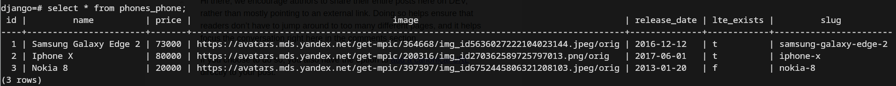

# Домашнее задание по теме "03. Работа с ORM"

## Выполнил Шаповалов Кирилл, студент группы DJ-90

Чтобы использовать в данном задании БД PostgreSQL - поднял в докере PostgreSQL 14


Теперь в `settings.py` будет работать подключение БД Postgres:

```py
DATABASES = {
    "default": {
        "ENGINE": "django.db.backends.postgresql",
        "NAME": "django",
        "HOST": "127.0.0.1",
        "PORT": "5432",
        "USER": "django",
        "PASSWORD": "django",
    }
}
```

Далее, создал модель `Phone`, содержащую все необходимые по заданию поля:

```py
from django.db import models


class Phone(models.Model):
    id = models.IntegerField(primary_key=True)
    name = models.CharField(max_length=100, null=False)
    price = models.FloatField()
    image = models.URLField()
    release_date = models.DateField()
    lte_exists = models.BooleanField()
    slug = models.SlugField(max_length=100)
```

Дописал сохранение данных в скрипте импорта данных из csv-файла:

```py
import csv

from django.core.management.base import BaseCommand
from django.utils.text import slugify
from phones.models import Phone


class Command(BaseCommand):
    def add_arguments(self, parser):
        pass

    def handle(self, *args, **options):
        with open('phones.csv', 'r') as file:
            phones = list(csv.DictReader(file, delimiter=';'))

        for phone in phones:
            Phone.objects.create(
                id=phone.get('id'),
                name=phone.get('name'),
                price=phone.get('price'),
                image=phone.get('image'),
                release_date=phone.get('release_date'),
                lte_exists=phone.get('lte_exists'),
                slug=slugify(phone.get('name'), allow_unicode=True),
            )
```

Написал view-функции:

```py
from django.shortcuts import render, redirect
from phones.models import Phone


def index(request):
    return redirect('catalog')


def show_catalog(request):
    template = 'catalog.html'
    sort = request.GET.get('sort')
    if sort:
        if sort == 'name':
            phones = Phone.objects.all().order_by('name')
        elif sort == 'min_price':
            phones = Phone.objects.all().order_by('price')
        elif sort == 'max_price':
            phones = Phone.objects.all().order_by('-price')
    else:
        phones = Phone.objects.all()    
    context = {
        'phones': phones
    }
    return render(request, template, context)


def show_product(request, slug):
    template = 'product.html'
    context = {
        'phone': Phone.objects.get(slug=slug)
    }
    return render(request, template, context)
```

Выполнил миграции:


Далее выполнил импорт данных из csv-файла:


Для надежности убедился, что данные в БД появились:



Запустил сервер командой `python manage.py runserver` и проверил все в браузере.

1. При переходе на адрес `localhost:8000` происходит редирект на каталог


2. Проверил работу сортировки по цене: отсортировал по минимальной цене


3. Проверил работу сортировки по имени


4. Перешел в любой элемент каталога, чтоб увидеть данные


Все работает корректно, основное задание выполнено успешно.