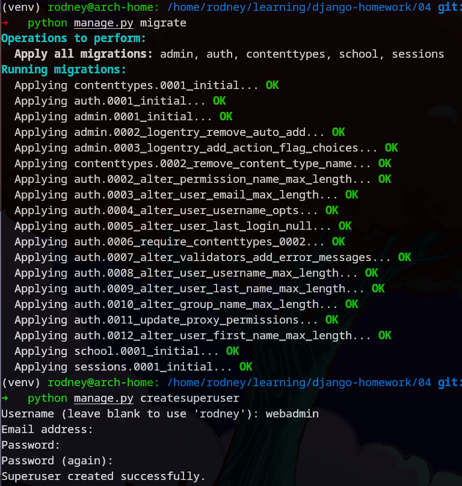
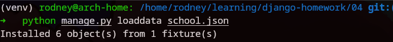
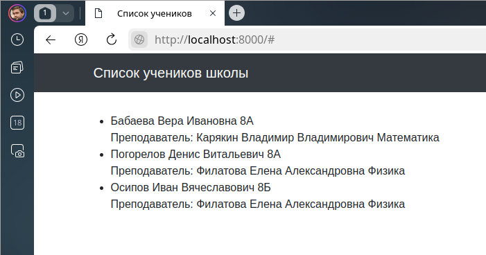
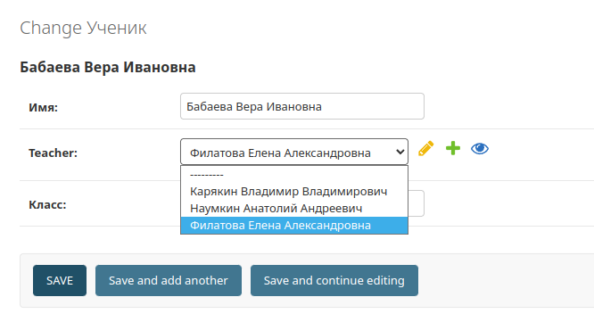
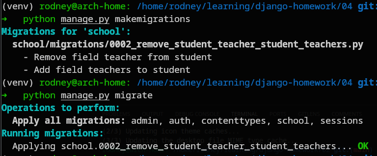
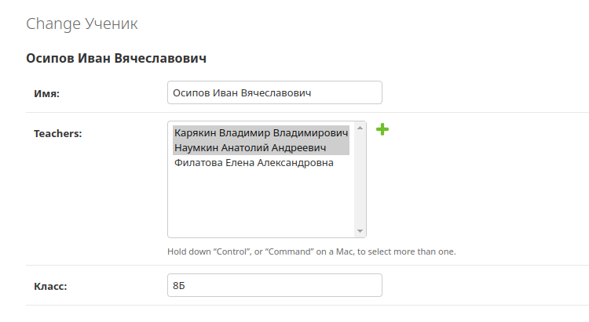
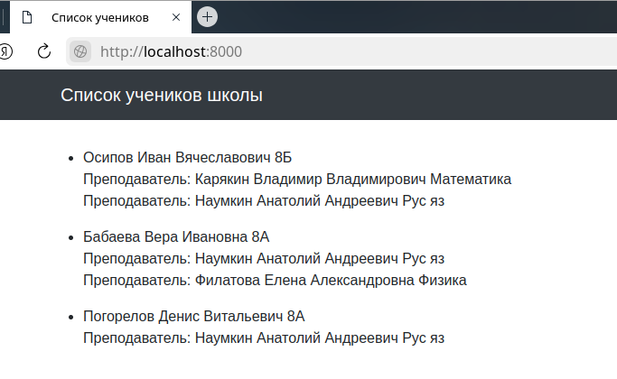

# Домашнее задание по теме "04. Работа с ORM, часть 2"

## Выполнил Шаповалов Кирилл, студент группы DJ-90

<br />

Задание 1. Миграции
-------------------

Для начала, дописал view-функцию, загрузил данные из json-файла и проверил как будет работать приложение без внесенных по заданию изменений.

```py
from django.shortcuts import render
from django.views.generic import ListView

from .models import Student, Teacher


def students_list(request):
    template = "school/students_list.html"
    student = Student.objects.all().prefetch_related('teacher')
    context = {
        "object_list": student
    }
    ordering = "group"
    return render(request, template, context)
```

По сути, сразу же выполнил требование дополнительного задания - применил конструкцию `prefetch_related`, позволяющую оптимизировать запросы к БД.

Подготовил и выполнил миграции, заодно сразу же создал суперпользователя для админки.



Загрузил данные из json.



Запустил сервер командой `python panage.py runserver` и проверил, что все работает



Зайдя в админку, можно убедиться, что сейчас работает связь один-к-одному - то есть для одного ученика можно выбрать только одного преподавателя.



Множественного выбора нет. Нужно это изменить.

Доработал модель `Student` - вместо закомментированной строки добавил новую с типом ManyToManyField

```py
class Student(models.Model):
    name = models.CharField(max_length=30, verbose_name='Имя')
#    teacher = models.ForeignKey(Teacher, on_delete=models.CASCADE)
    teachers = models.ManyToManyField(Teacher, related_name='students')
    group = models.CharField(max_length=10, verbose_name='Класс')

    class Meta:
        verbose_name = 'Ученик'
        verbose_name_plural = 'Ученики'

    def __str__(self):
        return self.name
```

Снова создал и применил миграции, так как любые изменения моделей требуют создания и применения миграций.



Изменил html-шаблон под новые условия - добавил вывод циклом списка учителей

```html
<div class="row">
  <ul>
  
    <li>{{ student.name }} {{ student.group }}
      <p> 
      Преподаватель: {{ teacher.name }} {{ teacher.subject }}<br>
      </p>
    </li>
  
  </ul>
</div>
```

Теперь можно снова запустить сервер и проверить работу приложения.

Сразу же перейду в админку и выберу разных учителей для разных студентов.



Так же сделаю и для другого ученика. Теперь нужно сохранить изменения и проверить вывод на странице.



**Все работает корректно, первое задание выполнено.**

<br>

Задание 2. Связь "Многие-ко-многим"
-----------------------------------

