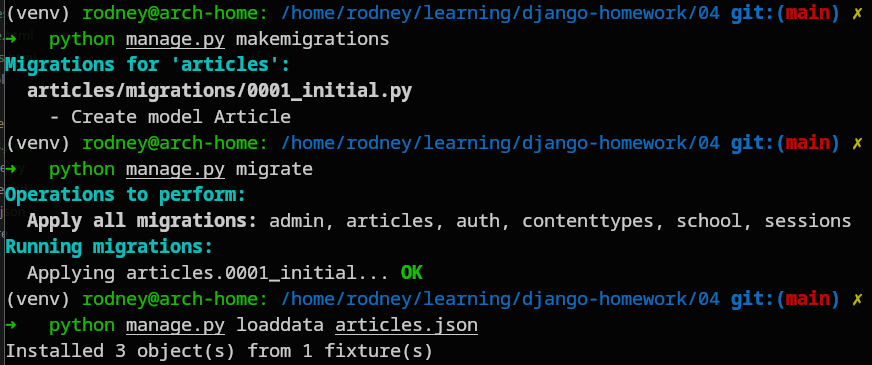
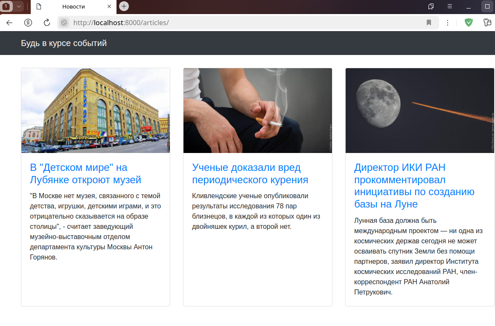
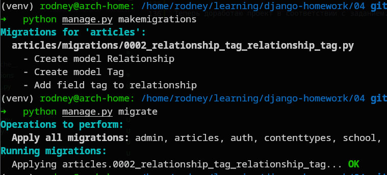
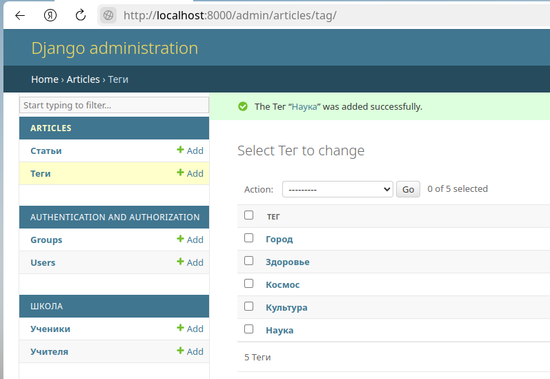
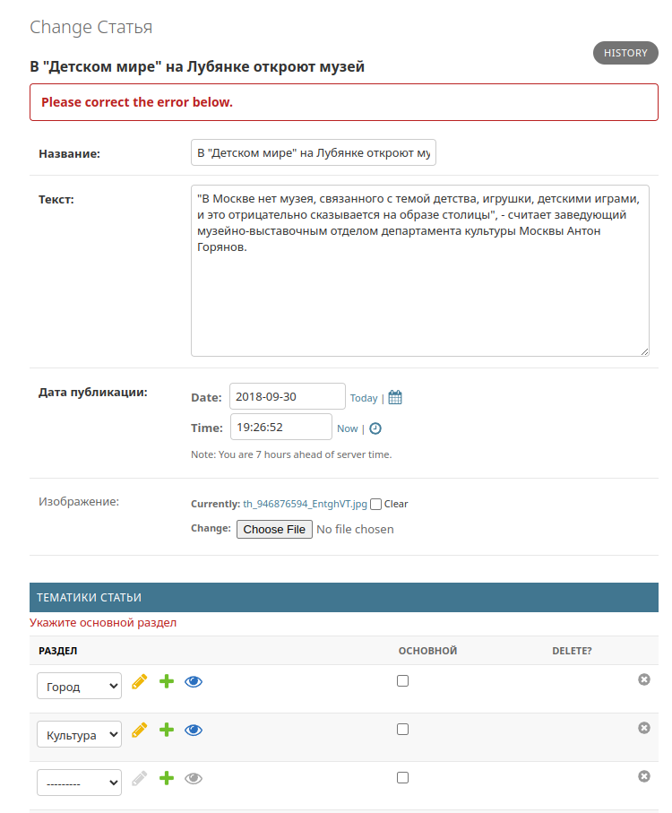
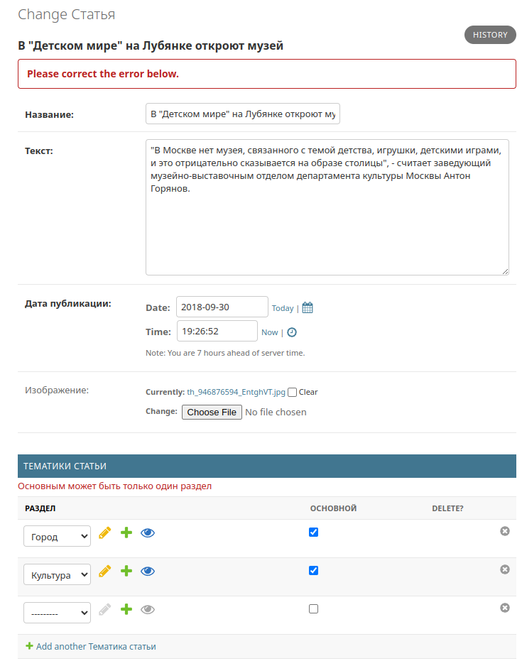
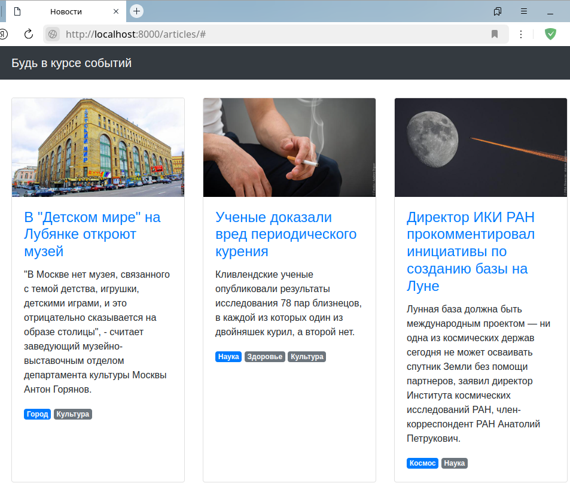

# Домашнее задание по теме "04. Работа с ORM, часть 2"

## Выполнил Шаповалов Кирилл, студент группы DJ-90

<br />

Задание 1. Миграции
-------------------

Для начала, дописал view-функцию, загрузил данные из json-файла и проверил как будет работать приложение без внесенных по заданию изменений.

```py
from django.shortcuts import render
from django.views.generic import ListView

from .models import Student, Teacher


def students_list(request):
    template = "school/students_list.html"
    student = Student.objects.all().prefetch_related('teacher')
    context = {
        "object_list": student
    }
    ordering = "group"
    return render(request, template, context)
```

По сути, сразу же выполнил требование дополнительного задания - применил конструкцию `prefetch_related`, позволяющую оптимизировать запросы к БД.

Подготовил и выполнил миграции, заодно сразу же создал суперпользователя для админки.


Загрузил данные из json.


Запустил сервер командой `python panage.py runserver` и проверил, что все работает


Зайдя в админку, можно убедиться, что сейчас работает связь один-к-одному - то есть для одного ученика можно выбрать только одного преподавателя.


Множественного выбора нет. Нужно это изменить.

Доработал модель `Student` - вместо закомментированной строки добавил новую с типом ManyToManyField

```py
class Student(models.Model):
    name = models.CharField(max_length=30, verbose_name='Имя')
#    teacher = models.ForeignKey(Teacher, on_delete=models.CASCADE)
    teachers = models.ManyToManyField(Teacher, related_name='students')
    group = models.CharField(max_length=10, verbose_name='Класс')

    class Meta:
        verbose_name = 'Ученик'
        verbose_name_plural = 'Ученики'

    def __str__(self):
        return self.name
```

Снова создал и применил миграции, так как любые изменения моделей требуют создания и применения миграций.


Изменил html-шаблон под новые условия - добавил вывод циклом списка учителей

```html
<div class="row">
  <ul>
  
    <li>{{ student.name }} {{ student.group }}
      <p> 
      Преподаватель: {{ teacher.name }} {{ teacher.subject }}<br>
      </p>
    </li>
  
  </ul>
</div>
```

Теперь можно снова запустить сервер и проверить работу приложения.

Сразу же перейду в админку и выберу разных учителей для разных студентов.


Так же сделаю и для другого ученика. Теперь нужно сохранить изменения и проверить вывод на странице.


**Все работает корректно, первое задание выполнено.**

<br>

Задание 2. Связь "Многие-ко-многим"
-----------------------------------

Приложение `Articles` добавил сюда же к проекту со школой, получилось как раз два приложения в одном проекте :)

Подготовил файл проекта `urls.py`, чтоб он теперь работал с двумя проектами, а так же зарегистрировал новый проект в `settings.py`:

```py
INSTALLED_APPS = [
    "django.contrib.admin",
    "django.contrib.auth",
    "django.contrib.contenttypes",
    "django.contrib.sessions",
    "django.contrib.messages",
    "django.contrib.staticfiles",
    "school",
    "articles",
]
```

```py
urlpatterns = [
    path("", include("school.urls")),
    path("", include("articles.urls")),
    path("admin/", admin.site.urls),
] + static(settings.MEDIA_URL, document_root=settings.MEDIA_ROOT)
```

Выполнил все миграции и загрузил данные:



Ну и наконец вывел все это, чтоб проверить базовую работу приложения:



Теперь доработаю проект в соответствии с заданием.

Добавил необходимые модели, итоговый файл `models.py`:

```py
from django.db import models


class Article(models.Model):

    title = models.CharField(max_length=256, verbose_name='Название')
    text = models.TextField(verbose_name='Текст')
    published_at = models.DateTimeField(verbose_name='Дата публикации')
    image = models.ImageField(null=True, blank=True, verbose_name='Изображение',)

    class Meta:
        verbose_name = 'Статья'
        verbose_name_plural = 'Статьи'
        ordering = ['-published_at']

    def __str__(self):
        return self.title

class Tag(models.Model):
    id = models.BigAutoField(primary_key=True)
    title = models.CharField(max_length=50, verbose_name='Тег')
    articles = models.ManyToManyField(Article, through='Relationship', related_name='tags')

    class Meta:
        verbose_name = 'Тег'
        verbose_name_plural = 'Теги'
        ordering = ['title']

    def __str__(self):
        return self.title

class Relationship(models.Model):
    id = models.BigAutoField(primary_key=True)
    article =  models.ForeignKey(Article, on_delete=models.CASCADE, related_name='scopes')
    tag = models.ForeignKey(Tag, on_delete=models.CASCADE, related_name='scopes', verbose_name='Раздел')
    is_main = models.BooleanField(default=False, verbose_name='Основной')

    class Meta:
        verbose_name = 'Тематика статьи'
        verbose_name_plural = 'Тематики статьи'
        ordering = ['-is_main', 'tag']
```

Изменил отображение в админке, добавил проверки на то, указан ли один главный раздел, итоговый файл `admin.py`:

```py
from django.contrib import admin
from django.core.exceptions import ValidationError
from django.forms import BaseInlineFormSet

from .models import Article, Relationship, Tag


class RelationshipInlineFormset(BaseInlineFormSet):
    def clean(self):
        main_count = 0
        for form in self.forms:
            for key, value in form.cleaned_data.items():
                if key == 'is_main' and value is True:
                    main_count += 1
        if main_count == 0:
            raise ValidationError('Укажите основной раздел')
        elif main_count > 1:
            raise ValidationError('Основным может быть только один раздел')

        return super().clean()


class RelationshipInline(admin.TabularInline):
    model = Relationship
    formset = RelationshipInlineFormset


@admin.register(Article)
class ArticleAdmin(admin.ModelAdmin):
    inlines = [RelationshipInline]


@admin.register(Tag)
class TagAdmin(admin.ModelAdmin):
    pass
```

Создал и применил миграции после изменения моделей



Проверяю работу приложения. Добавил несколько тегов в админке:



Для статьи выбрал два тега, но не указал основной, попытался сохранить:



Проверка отработала и не дала сохранить статью. Попробовал указать два основных тега:



Также отработала проверка, не дав сохранить статью. Укажу один основной тег и остальные дополнительные для всех статей и проверю в браузере.



Теги отображаются в каждой статье. Задание выполнено успешно.

**Итого: оба задания выполнены.**

